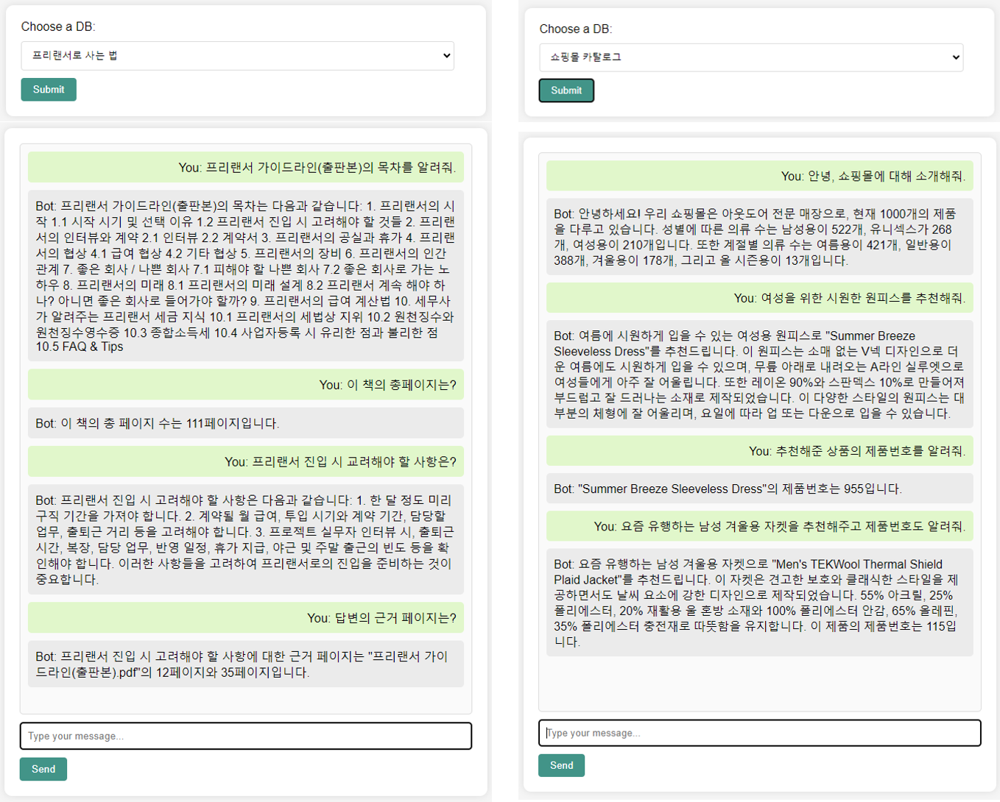

# ahnlab17_work
## 안랩아카데미 17기 chatGPT 활용 챗봇 개발 수업(최종 과제)

### 최종제출 파일
1. be_2_fastapi_2.py : 이 코드는 서버를 설정하고 API 요청을 처리하기 위해 필요한 모델과 엔드포인트를 정의합니다.
   코드는 강사님이 주신 파일에 챗봇 인터페이스 부분을 수정하면서 # CORS 설정 추가 하였습니다.
2. langchain_E_retrieval_tool.py : 이 코드는 Langchain 프로젝트의 챗봇 기능을 실행하는 메인 함수입니다.  
   코드는 강사님이 주신 파일에 과제를 구현하는 함수를 추가해서 만들었습니다.   
    *필요한 모듈과 패키지를 가져옵니다.
    - import pandas as pd(추가)
    - from langchain.chains.summarize import load_summarize_chain(추가)
    - from langchain.document_loaders import PyPDFLoader (추가)   
    • 환경 변수에서 OpenAI API 키와 조직을 설정합니다.   
    • Langchain의 ChatOpenAI 클래스의 인스턴스를 생성합니다.   
    • get_freelancer_guidelines_summary() 함수를 사용하여 프리랜서 가이드라인의 요약 정보를 가져옵니다.   
    • get_total_page_count() 총 페이지 수를 계산하는 함수   
    • get_page_count_document() 계산된 페이지 수를 문서화   
    • get_table_of_contents() 함수를 사용하여 프리랜서 가이드라인의 목차를 추출합니다.   
    • infer_gender() 함수를 사용하여 제품의 성별을 추론합니다.   
    • infer_season() 함수를 사용하여 제품의 계절을 추론합니다.   
    • calculate_product_statistics() 함수를 사용하여 제품 통계를 계산합니다.   
    • get_personal_retriever() 함수를 사용하여 개인 정보를 가져옵니다.   
    • get_freelancer_guidelines() 함수를 사용하여 프리랜서 가이드라인을 가져옵니다.   
    • get_freelancer_guidelines_summary() 함수를 사용하여 프리랜서 가이드라인의 요약 정보를 가져옵니다.   
    • get_page_count_retriever() 함수를 사용하여 프리랜서 가이드라인의 총 페이지 수를 가져옵니다.   
    • get_table_of_contents_retriever() 함수를 사용하여 프리랜서 가이드라인의 목차를 가져옵니다.   
    • get_outdoor_clothing_catalog() 함수를 사용하여 아웃도어 의류 카탈로그를 가져옵니다.   
    • get_outdoor_clothing_stats() 함수를 사용하여 아웃도어 의류 카탈로그의 통계 정보를 가져옵니다.   
    • get_tools() 함수를 사용하여 도구 목록을 가져옵니다.  
    • chat_qa() 함수를 사용하여 챗봇 기능을 실행합니다.   
    • input_select() 함수를 사용하여 메뉴를 선택합니다.  
    • main() 함수를 사용하여 프로그램을 실행합니다.   
3. index.html : 이 코드는 간단한 싱글 페이지 어플리케이션(SPA)의 프론트엔드 부분을 나타냅니다. 사용자가 데이터베이스(DB)를 선택하고,
   채팅 인터페이스를 통해 메시지를 입력하면, 해당 메시지를 서버에 전송하고 응답을 받아 화면에 표시하는 방식으로 작동합니다.

코드는 be_2_fastapi_2.py를 실행하면 됩니다. 
과제 구현에서 답변에 근거 페이지는 함께 표시하지 못했지만 답변에 대한 근거 페이지를 질문하면 답변을 해줍니다.   
그리고 질문 시 전체라는 말이 들어가면 가끔 먹통이 되는 경우가 있습니다. 그래서 내용을 요약해줘. 목차를 보여줘를 하면 괜찮은데 전체 내용 또는 전체 목차하면 시간이 오래 걸리거나 먹통이 됩니다.   
@@@ 모든 코드는 ChatGPT의 도움으로 작성하였습니다. @@@   
